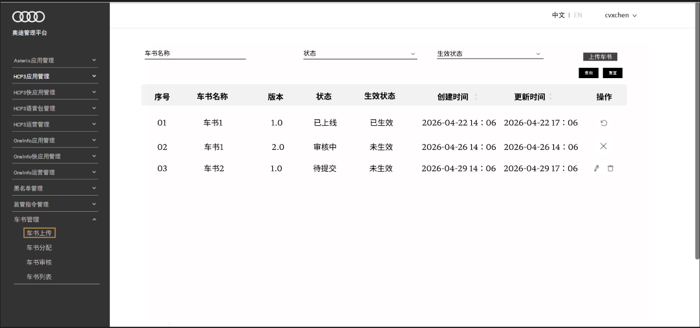
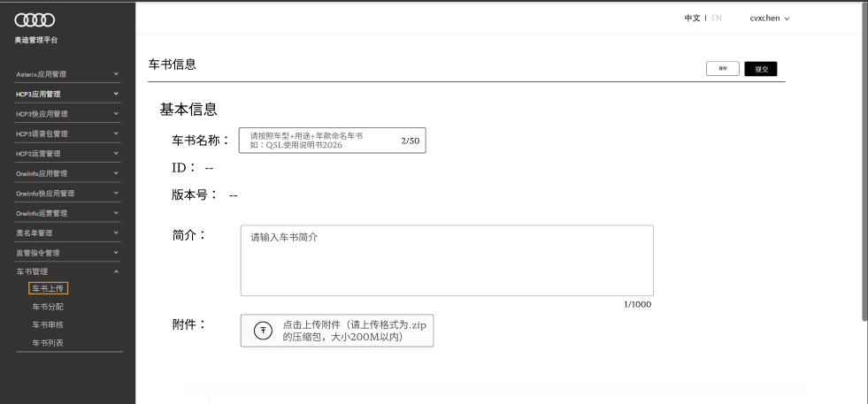

# 【PI26\.2 S04 HMI】 车书上传 

# 一、 变更日志

|**时间**|**版本号**|**变更人**|**变更内容**|
|---|---|---|---|
|2026\.05\.15|V1\.0|许谨怡|初始PRD|

# 二、概述 

## 背景

车书是指车辆使用手册，主要内容包含：车辆基础信息、座舱操作、车载信息娱乐系统操作、驾驶操控与行驶功能的介绍、安全系统与动力系统的介绍等信息，考虑到用户遇到问题时自己查阅手册的效率太低，于是提出根据车书内容训练出智能问答知识库的需求。

## 目标

希望建立一个操作平台，该平台包括四个菜单，分别是车书上传、生成知识库、知识库审核、知识库列表。该prd描述的是车书上传的功能细节。

# 三、需求内容

## 1\.上传车书

- 点击上传车书按钮，进入车书信息详情页，包含的内容有车书名称、车书ID、版本号、车书简介和车书附件。需要用户填写的信息有：车书名称、简介和附件，三项都为必填项。车书ID及版本号由系统自动生成。

- 提交之前可以保存为草稿，状态为待提交，点击提交后状态变为待生成知识库。

- 提交之前必填项必须填写，否则不可提交。

- 各项信息的填写规范：

1\.车书名称：

（1）长度限制为2\~50个字符，超限无法继续输入；

（2）禁止特殊符号 \\ / : \* ? " \< \> \|

（3）提交时会进行重复校验，以保证车书名称的唯一性；

（4）若名称的首位或末位为空格，提交时将自动去除；

（5）输入框提示如图所示

2\.车书简介：

仅对字符数量有限制，限1000字以内，超限无法继续输入。

3\.车书附件：

附件格式限\.zip格式，数量限一个，大小限200M以内。上传后有删除按钮以便重传。

4\.ID和版本号的生成逻辑：

（1）ID：无特殊要求，自动生成即可，长度在6个字符以内。

（2）版本号：从1.0开始递增，如：1.0，2.0，3.0依次递增

## 2\.车书上传列表页

- 列表页展示的信息及每个信息的定义为：

1\.序号

2\.车书名称：

3\.版本：当前版本号

4\.状态：待提交、已撤销、待生成知识库、待审核、审核不通过、已上线、已回退

其中，待提交为保存草稿后的状态，撤回后状态为已撤销，车书提交后为待生成知识库状态，知识库生成后，在审核模块可以试用知识库回答效果，可审核通过或不通过，审核通过后，知识库将立即上线，出现在车书列表中，状态变为已上线，知识库被回退后，车书状态变为已回退。

5\.生效状态：当前在线版本中的最高版本为生效状态，同一车书，若有已上线的版本，有且仅有一个生效状态的版本。取值有已生效和未生效

6\.创建时间：首次创建记录（包括草稿）的时间

7\.更新时间：每一次编辑后保存或提交后更新时间

8\.操作：包括更新版本、编辑、撤回、删除

（1）更新版本：更新按钮的展示逻辑为：1\.只在已上线\+已生效的版本展示；2\.点击更新按钮后，在新的版本审核通过前，按钮隐藏。

即：当1\.0版本上线后，列表页该条数据的更新版本按钮可见。点击更新按钮后进入详情页，详情页保留该版本的信息，可修改的信息有：车书简介和上传附件，车书名称和ID不可更改，版本号在提交时自动\+1。此时2\.0版本状态为审核中，1\.0的更新按钮隐藏，2\.0版本上线后，对应的生效状态为已生效，此时1\.0的生效状态为未生效，2\.0的更新按钮可见。若2\.0审核未通过，则1\.0的更新按钮恢复，点击更新后，生成版本号为3\.0的数据。

（2）编辑：草稿状态时或提交之后撤销，编辑按钮可见。版本1\.0可编辑的内容有：车书名称、简介和附件，版本1\.0之后只可编辑车书简介和附件。

（3）撤回：车书提交后生成知识库前，撤回按钮可见，可以执行撤回，知识库生成后，撤回按钮隐藏；

（4）删除：草稿状态下，删除按钮可见。

- 列表展示顺序逻辑：默认按照创建时间降序展示，支持创建时间和更新时间升序/降序切换。

## 3\.筛选项

- 筛选项包括：

（1）车书名称：自定义输入搜索内容，字数无上限；

（2）状态：下拉选择全部、待提交、已撤销、待生成知识库、待审核、审核不通过、已上线、已回退；

（3）生效状态：下拉选择全部、已生效、未生效。

## 4\.页面交互：

- 点击车书名称进入详情页，详情页展示车书信息：车书名称、车书状态、生效状态、创建时间、ID、版本号、简介、附件（文件名，大小，下载按钮，上传时间）

- 筛选查询：

（1）输入车书名称点击查询，列表展示查询结果；点击重置取消筛选条件，列表恢复至全部记录；若查询无匹配结果，页面显示“暂无数据”；

（2）点击状态下拉框选择状态，点击查询，列表展示查询结果；点击重置取消筛选条件，列表恢复至全部记录；若查询无匹配结果，页面显示“暂无数据”；

（3）点击生效状态下拉框选择状态，点击查询，列表展示查询结果；点击重置取消筛选条件，列表恢复至全部记录；若查询无匹配结果，页面显示“暂无数据”。

- 上传车书：

点击上传车书创建新的车书，填写车书信息，点击保存可存为草稿，点击提交车书创建成功。

- 列表页：

（1）点击列表车书名称进入车书详情页；

（2）按创建时间排序：在默认排序情况下，点击一次切换为按创建时间降序排序，最新创建的在最上面，再次点击切换为按创建时间升序排序，最早创建的在最上面，再次点击返回默认排序；

（3）按更新时间排序：在默认排序情况下，点击一次切换为按更新时间降序排序，最后更新的在最上面，再次点击切换为按更新时间升序排序，最早更新的在最上面，再次点击返回默认排序；

- 操作列：

（1）编辑：点击进入车书信息填写页面，自动带入当前已有的信息。页面右上角按钮为：提交和保存。

（2）删除：点击删除弹出二次确认弹窗“确定要删除该车书吗?"，点击确定后删除车书，该车书在列表页消失。

（3）撤回：点击撤回弹出二次确认弹窗”确定要撤回该车书吗?"，点击确定后撤回车书，撤回后车书状态变为待提交，操作列展示“编辑”与“删除”按钮。

（4）更新版本：点击更新按钮后进入车书当前信息页面，页面右上角按钮为：提交和取消。
## 5\.详情页

详情页包含的信息有：

- 车书名称

- 车书状态

- 生效状态

- 创建时间

- ID、版本号

- 简介

- 附件（文件名，大小，下载按钮，上传时间）

## 6\.异常情况提示：

|输入项|错误情况|文案提示|
|---|---|---|
|车书名称|未输入内容|请输入车书名称|
||只输入一个字符|请输入2\~50个字符|
||名称包含禁止的特殊符号|名称含非法特殊字符，请重新输入|
||校验时名称已存在|该车书名称已存在，请修改后重新输入|
|车书简介|未输入内容|请输入车书简介|
|车书附件|未上传压缩包|请上传车书附件|
||上传非\.zip格式的文件|文件格式错误，请重新选择。|
||上传的zip文件大于200M|文件大小超出限制|

